<h1 align="center">
  👩🏻‍💻 Glaucia Messias 
  Senior QA Analyst | QA Automation
</h1>

  
  

  
  

  
  

  
  

  
  

  
  

  
  

  
  

  
  

  

 

  

  

 

  
  

 

<picture>
  <source media="(prefers-color-scheme: dark)" srcset="https://raw.githubusercontent.com/glaugm/glaugm/pacman-output/pacman-contribution-graph-dark.svg?game=pacman">
  <source media="(prefers-color-scheme: light)" srcset="https://raw.githubusercontent.com/glaugm/glaugm/pacman-output/pacman-contribution-graph.svg?game=pacman">
  
</picture>
